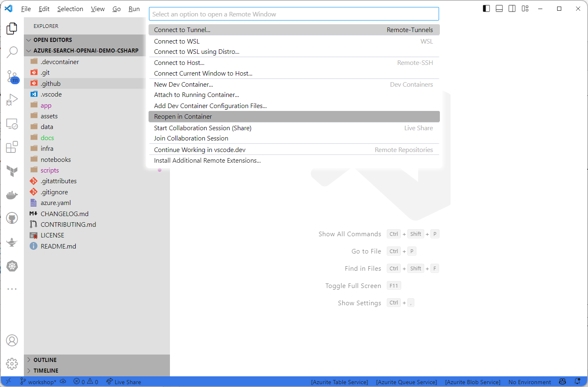
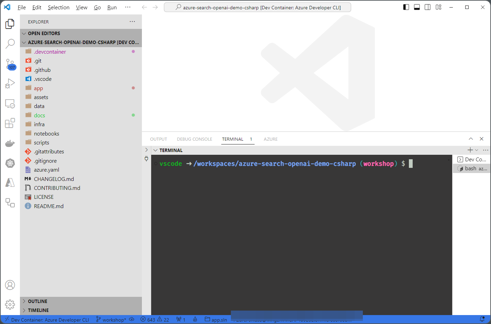
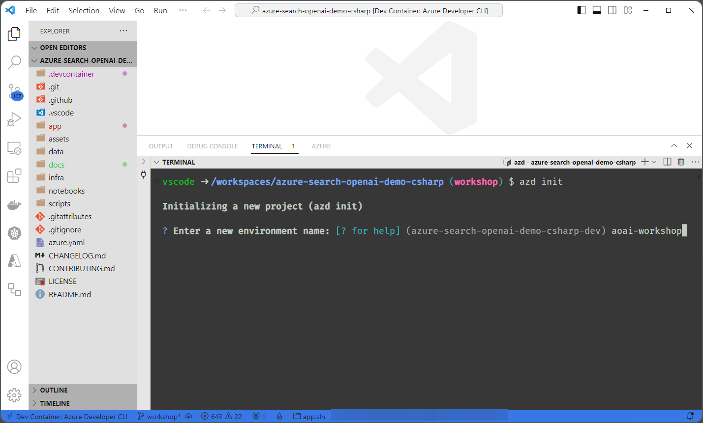
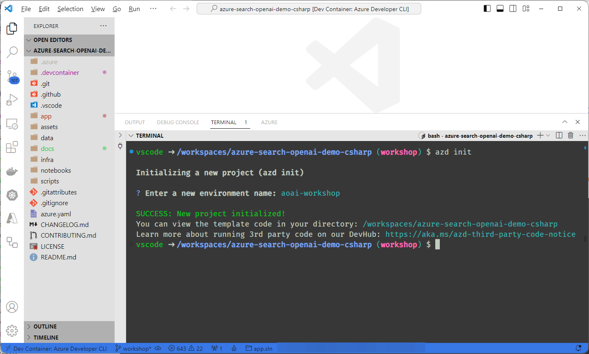
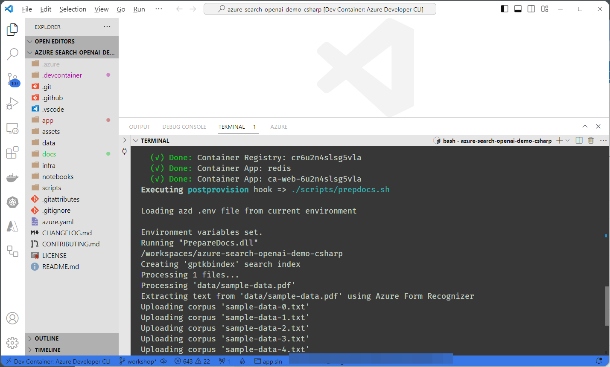
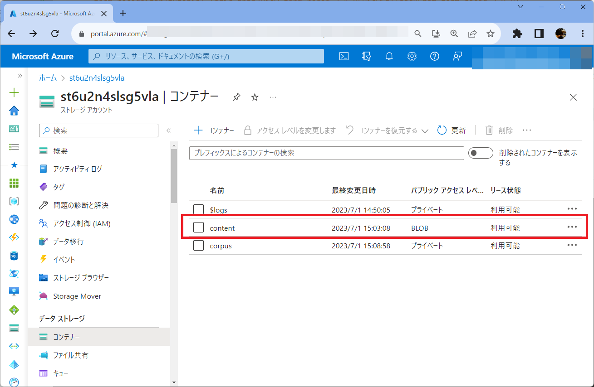
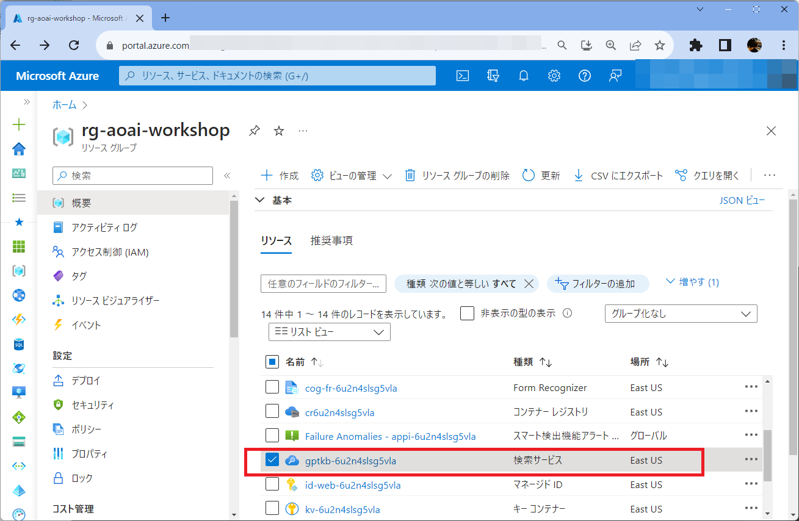

# **業務データを活用した生成AIチャットシステム ワークショップ(コンテナアプリバージョン)**

OpenAIによって開発された大規模な言語モデルGPTを活用すると、テキスト生成/自然言語理解/文章の翻訳などのさまざまなタスクをこなすことができます。これらを業務に活用することで、これまで負荷のかかっていた作業を省力化できる可能性があるため、大きく注目されています。

たとえば、業務ナレッジ/設計書/技術文書/製品メンテナンス情報がPDF/PowerPoint/Excelファイルでばらばらに管理されている企業は多いのではないでしょうか？これらの中には非常に有用な情報であるにもかかわらず、社内で十分に有効活用されていない、また必要な情報にたどり着くまでに時間がかかり生産性の低下をおこしたりコミュニケーションコストの増大をおこしていることもあります。

例えば、<span style="font-weight: bold; color: steelblue;"> 「私は水素ハイブリット電車の設計者です。〇〇の設計上の注意点は何ですか？」</span>   と自然言語で専門用語や業務固有のナレッジについて問い合わせると、GPTが適切なクエリを生成して必要な情報を検索します。その検索結果をさらに集約して、質問者の問いに対するピンポイントな回答や要約ができれば、<span style="font-weight: bold; color: steelblue;"> 「〇〇さんに聞かなければわからない貴重なノウハウ」「どこにあるか分からない情報を捜すのに苦労している」</span>など現場の多くの課題を解決できます。


このシステムを社内導入するためには、GPTなどAIそのものの知識に加えて、AIを組み込んだWebアプリケーションをどう実装するか？や、セキュリティを担保しつつどう運用管理するか？などの幅広い知識が求められます。

---

このワークショップでは、 <span style="font-weight: bold; color: steelblue;"> 研究論文の内容もとに適切な回答を作成するチャットシステム</span> の作成を通して、Azure OpenAI やAzure Cognitive Searchなどの使い方やチャットシステムを社内に展開するためのWebアプリケーションの作成やAPI基盤の整備などの基礎を学びます。

このワークショップの特徴は次の2つです。

- **専門用語や業界独自のナレッジを検索できる**

ChatGPT(gpt-35-turbo)モデルでトレーニングされたデータに基づいてテキストを生成するのではなく、企業内に閉じたデータをもとに生成します

- **回答の根拠を明確にする**

ChatGPTの回答に「引用」をテキストに付加することで、より信頼できる応答を生成します


このワークショップは、AI技術に興味のあるデータサイエンティスト、エンジニア、研究者、または企業内での情報アクセスやナレッジ共有の改善を目指す方々に適しています。


## 🔧事前準備

ワークショップを始める前に、お使いの開発マシンに次の環境を準備します。
* [Visual Studio Codeのインストール](https://code.visualstudio.com/download)
* [Dockerのインストール](https://www.docker.com/get-started)
* [GitHubアカウントの作成](https://github.co.jp/)

!> このワークショップを実行するには、 **Azure OpenAI へのアクセスを有効にした** Azure サブスクリプションが必要です。アクセスは[こちら](https://aka.ms/oaiapply)からリクエストできます。

本ワークショップの受講者は、基本的なAzureの知識とAzure ポータルでの操作経験を前提としています。またGitHubの操作経験と基本的なプログラミング知識が必要となります。

---
# **Part1: Azure環境構築とサンプルアプリのデプロイ** 

このパートでは、ワークショップをおこなう上で必要なAzure環境を構築します。


ワークショップでは、ダミー論文をデータセットとして利用します。実際の業務データを使いたい場合は、データを用意してください。


#### このパートのゴール
* Azure Developer CLI/Bicepを活用したコードによるAzure環境の構築やアプリケーションのデプロイの流れを知る


## 💻1. サンプルアプリの準備


まず、ブラウザを開きご自身のアカウントでGitHubにアクセスします。そして、[こちら](https://github.com/asashiho/azure-search-openai-demo-csharp)のサンプルコードを自分のリポジトリにForkします。


次に、Visual Studio Codeを起動します。 **[表示]-[拡張機能]** を選び、検索で **「Dev Containers」** を選び、この拡張機能を **[インストール]** をします。これはコンテナ環境で開発環境を動かすための拡張機能です。


ターミナルから次のコマンドを実行してForkしたリポジトリをクローンします。

```bash
git clone https://github.com/<Your_GitHub_Name>/azure-search-openai-demo-csharp
```


次に **[ファイル]-[フォルダを開く]** を選び クローンした **「`azure-search-openai-demo-csharp`」** フォルダを開いてください。

!>もし異なるフォルダを開いている場合、本ワークショップで必要な環境がセットアップされませんので、注意してください。


サンプルフォルダを開いたら、Visual Studio Codeの左下の[`><`]アイコンをクリックして「`Reopen in Container`」を選びます。



ターミナルを確認すると、今回のワークショップで使用するライブラリ群がインストールされているのがわかります。


数分するとインストールが完了します。[`>< Dev Container: Azure Developer CLI`]となり、次のようなターミナル(コマンドを実行する箇所)が表示されます。これは、開発に必要な環境一式がDockerコンテナとして起動できるVisual Studio CodeのDevContainersという機能を使っています。もしエラー等で起動できない場合は、Visual Studio Codeを再起動しローカルPCでDockerコンテナが動作しているかを確認してください。





これで開発の準備ができました。


?>**コンテナを活用した開発環境の構築**<br>
アプリケーションを開発するときに、まず行うべきことは開発環境の作成です。言語ランタイムやライブラリをデバッグやテストに必要なツール群をインストール・設定する必要があります。
Visual Studio CodeのRemote-Containers 拡張機能を使用すると、開発環境をDockerコンテナで動かすことができます。
コンテナ内に開発環境を閉じ込めることができるため、ランタイムバージョンの異なる環境・開発言語が異なる環境もコンテナを切り替えるだけで利用できます。
また、標準化した環境を作成するためのDockerfileを作っておけば、大規模プロジェクトで複数の開発するメンバーが参画するときも、コンテナイメージを共有すればよいだけので、統一された環境をつかって開発を始めることができます。<br>
 公式ドキュメント:「[Developing inside a Container](https://code.visualstudio.com/docs/remote/containers)」


## 💻2. Azure環境の作成とサンプルアプリのデプロイ

本ワークショップではAzureの環境作成とサンプルアプリのデプロイに[Azure Developer CLI](https://learn.microsoft.com/ja-jp/azure/developer/azure-developer-cli/overview)を利用します。

Azure Developer CLI(`azd`コマンド)は、Azureのリソースを管理するためのオープンソースのコマンドラインツールです。Azure Developer CLIを使用することで、Azure上のリソースの作成、更新、削除などを行うことができます。またAzure Developer CLIは、Azureのリソースを管理するためのスクリプトを作成する際にも役立ちます。Azure Developer CLIを使用することで、Azure上のリソースをプログラムから操作することができ、IaCによる自動デプロイや管理ができます。また、[テンプレート](https://azure.github.io/awesome-azd/)が用意されているのでこれをもとに環境を素早く作成できます。このテンプレートは自作することも可能で、プロジェクトの要件にあわせたものを作成して開発チームで展開することができます。

`azd` テンプレートは、次のディレクトリ構成となっています。

```bash
├── .devcontainer              [ DevContainer のための設定ファイル ]
├── .github                    [ GitHub workflowの設定ファイル ]
├── infra                      [ Azureリソースを作成するためのディレクトリ ]
│   ├── main.bicep             [ メインのIaCコード ]
│   ├── main.parameters.json   [ パラメータファイル ]
│   └── core                   [ リファレンスライブラリからコピーしたBicepモジュールなど ]
└── azure.yaml                 [ アプリケーションと Azure リソースの設定 ]
```

新しい環境を初期化したい場合は、次のコマンドを実行します。

```bash
azd init
```
Azure Developer CLIでは、ワークフローとデプロイをカスタマイズするためのさまざまな拡張ポイントがサポートされています。フックを使用すると、コマンドと azd サービス ライフサイクル イベントの前後にカスタム スクリプトを実行できます。

|             名前             |                             説明                             |
| ---------------------------- | ------------------------------------------------------------ |
| prerestore / postrestore     | パッケージの依存関係が復元される前と後に実行                 |
| preprovision / postprovision | Azure リソースが作成される前と後に実行                       |
| predeploy / postdeploy       | アプリケーション コードが Azure にデプロイされる前と後に実行 |
| preup / postup               | 結合されたデプロイ パイプラインの前後に実行                  |
| predown / postdown           | リソースが削除される前と後に実行                             |


たとえば今回のサンプルの場合、`azure.yaml`をみると`postprovision`フックが設定されているため、BicepによってAzureリソースが作成し終わったあとに、`./scripts/prepdocs.ps1`または`./scripts/prepdocs.sh`が実行されます。この`prepdocs.ps1/prepdocs.sh`は`/data`配下のPDFデータから文字情報を抽出しAzure Blob Storageにチャンク分割したファイルを格納してAzure Cognitive Searchにインデックスを登録しています。詳細については、Part3を確認してください。

```yaml
name: azure-search-openai-demo-csharp
metadata:
  template: azure-search-openai-demo-csharp@0.0.3-beta
services:
  web:
    project: ./app/backend/
    host: containerapp
    language: dotnet
    docker:
      path: ../Dockerfile
      context: ../
hooks:
  postprovision:
    windows:
      shell: pwsh
      run: ./scripts/prepdocs.ps1
      interactive: true
      continueOnError: false
    posix:
      shell: sh
      run: ./scripts/prepdocs.sh
      interactive: true
      continueOnError: false
```

?> azd コマンドの詳細については[ドキュメント](https://learn.microsoft.com/ja-jp/azure/developer/azure-developer-cli/overview)を参照してください。


それでは、本ワークショップで使用するAzureの環境を構築します。Visual Studio Codeを起動し、ターミナルを開きます。


ターミナルに次のコマンドを入力してAzureにログインします。そしてAzure OpenAIが利用可能なAzureサブスクリプションを設定します。

例えば、サブスクリプションIDが「`aaaaaaaa-bbbb-cccc-dddddddddddd`」の場合、次のコマンドを実行します。

```bash
azd auth login

azd config set defaults.subscription aaaaaaaa-bbbb-cccc-dddddddddddd
```

!>必ずAzure OpenAIが利用可能なサブスクリプションを指定してください。


本ワークショップで使用するAzure環境はAzure Developer CLIで構築します。Visual Studio Codeのターミナルで次のコマンドを実行します。

まず [`azd init`](https://learn.microsoft.com/en-us/azure/developer/azure-developer-cli/reference#azd-init)コマンドで環境の設定を行います。

```bash
azd init
```

環境名を聞かれるので「`aoai-workshop`」と入力します。

```bash
Enter a new environment name: [? for help] (azure-search-openai-demo-csharp-dev) aoai-workshop
```






次に[`azd up`](https://learn.microsoft.com/en-us/azure/developer/azure-developer-cli/reference#azd-up)コマンドを実行し、Azure リソースをプロビジョニングして、サンプルアプリをデプロイします。

```
azd up
```

コマンドを実行すると、Azureのサブスクリプションが聞かれるので、Azure OpenAIが利用可能なサブスクリプションを選びます。

```bash
? Select an Azure Subscription to use:  [Use arrows to move, type to filter]
```

次にデプロイするAzureリージョンを聞かれれるので、Azure OpenAIが利用可能なリージョンを選びます。





デプロイの経過はAzure Portalからも確認できます。指定したリソースグループを開き、 **[設定]** - **[デプロイ]** をクリックするとリソースが表示されます。


なお作成されるAzure環境の全体構成はVisual Studio Codeの[Bicep Extention](https://marketplace.visualstudio.com/items?itemName=ms-azuretools.vscode-bicep)で可視化できます。


`infra\main.bicep`を選び右クリックで **[Open Bicep Visualizer]** をクリックすると構成がグラフィカルに表示されます。


# **Part2: 業務データを利用したナレッジ検索システム** 
このパートでは、PDFなどの業務データをもとにしたデータセットから、検索エンジンを作成する方法を説明します。


#### このパートのゴール
* Azure Form Recognizer を使ってドキュメントから文字データの抽出のしくみが分かる
* Azure Cognitive Search を使ってドキュメント検索ができる


?>ワークショップに必要なデータはあらかじめ`data`ディレクトリに準備されています。なお、本ワークショップでは、Part1で実行した`azd up` コマンドで`app\prepdocs\PrepareDocs` のプログラムを実行し、自動でAzure Blob Storageに保存し、Cognitive SearchへのIndex登録を行っているので、このパート(Part2)を飛ばしてもかまいません。

## 💻1. データセットのテキスト化

[Azure Form Recognizer](https://azure.microsoft.com/ja-jp/products/form-recognizer)は、OCR(Optical Character Recognition)と機械学習を利用してテキストを自動的に抽出し、構造化されたデータに変換するためのサービスです。

具体的には、Azure Form Recognizerは、さまざまな種類のドキュメントやフォーム(請求書/領収書/アンケート/契約書など)の画像やPDFファイルをアップロードし、その中のテキストを抽出します。OCRによって画像内の文字が読み取られ、機械学習モデルが文書の構造を解析し、データフィールド(日付/金額/住所など)を特定します。

Form Recognizerを使用することで、大量の紙文書や手書きのデータを手作業で入力する手間を省き、自動化されたデータ処理を実現できます。

Azure Form Recognizerは、APIとして提供されており、開発者は独自のアプリケーションやサービスに組み込むことができます。また、Azureポータルから使用することもできます。

Azureポータルを開き、リソースグループ「`rg-openai-workshop`」にある「 **Form Recognizer** 」を選びます。


「 **Form Recognizerスタジオ** 」 を起動します。


次に、サブスクリプション/リソースグループ/Cognitive Service Resourceを設定してください。 
 


これはGUIでドキュメントの読み取りやレイアウトなどの構成を試すことができるツールです。


Form Recognizer Studioの [ **Browser for a file** ] をクリックして、ダミー論文をアップロードします。ダミー論文のPDFは`data\sample-data.pdf`にあります。


[ **Run analysis** ] をクリックしてPDFからテキスト情報を抽出します。


抽出したデータは`Context`で確認できます。また位置情報や一括取得するためのソースコード例も表示されるので、確認しましょう。


これらのテキスト情報から検索システムを作成します。なお、本ワークショップでは、Part1で実行した`azd up`コマンドで`app\prepdocs\PrepareDocs`のプログラムを実行し、自動でBlobに保存しCognitive SearchへのIndex登録を行っています。


Azure Portalを開き、リソースグループ内のストレージアカウントをクリックします。


[ **データストレージ** ]-[ **コンテナ** ]をクリックすると`content`という名前のコンテナ―が作成されているのがわかります。



コンテナ―の中を確認すると、チャンク分割したデータが格納されています。


?>**参考情報**<br>
[Azure Form Recognizer 製品情報](https://azure.microsoft.com/ja-jp/products/form-recognizer) <br>
[Azure Form Recognizer のドキュメント](https://learn.microsoft.com/ja-jp/azure/applied-ai-services/form-recognizer/?branch=release-build-cogserv-forms-recognizer&view=form-recog-3.0.0)<br>
[チュートリアル: Form Recognizer で Azure Logic Apps を使用する](https://learn.microsoft.com/ja-jp/azure/applied-ai-services/form-recognizer/tutorial-logic-apps?view=form-recog-2.1.0&viewFallbackFrom=form-recog-3.0.0)

## 💻2. ナレッジ検索の確認

[Azure Cognitive Search](https://azure.microsoft.com/ja-jp/products/search)は、フルマネージド型の検索サービスです。このサービスを使用することで、構造化データや非構造化データをインデックス化し、高速で正確な検索システムを作成できます。また、自然言語処理や機械学習を活用することで、より高度な検索機能を提供することも可能です。

Azure Cognitive Searchは、APIを介して簡単にアクセスでき、.NET、Java、Pythonなどのプログラミング言語からも利用可能です。また、AzureポータルやVisual Studio Codeなどの開発ツールからも設定や管理ができるのが特徴です。

Part1の手順で、すでにAzure Cognitive Searchのデプロイとインデックスの作成が完了しているので、リソースを確認します。リソースグループ内の検索サービスをクリックします。



[ **設定** ]-[ **ナレッジセンター** ]をクリックし、[ **データの探索** ] タブをクリックします。


[ **検索エクスプローラの起動** ]をクリックします。


ここで、検索インデックスが「`gptkbindex`」になっていることを確認しクエリ文字列に「水素ハイブリット」と入力して [ **探索** ] ボタンをクリックします。応答で正しく検索結果が返っているのを確認します。


?>**参考情報**<br>
[Azure Cognitive Search の製品情報](https://azure.microsoft.com/ja-jp/products/search) <br> 
[Azure Cognitive Search のドキュメント](https://learn.microsoft.com/ja-jp/azure/search/)<br>
[クイックスタート: Azure SDK を使用したフル テキスト検索](https://learn.microsoft.com/ja-jp/azure/search/search-get-started-text?tabs=dotnet)<br>
[Azure Cognitive Search の C# コードサンプル](https://learn.microsoft.com/ja-jp/azure/search/samples-dotnet)<br>


# **Part3: サンプルアプリの動作確認** 

サンプルアプリは、Azure OpenAIとAzure Cognitive Searchを組み合わせて、AIとのチャットを行うものです。まずチャットUIから自然言語で問い合わせを行うとその内容をもとにAzure OpenAIが適切な検索クエリを生成し、その検索クエリをもとにAzure Cognitive Searchのデータを検索し、検索結果をもとにして自然言語で回答を作成してレスポンスを返します。

#### このパートのゴール
* Azure Container Appsを使ってサンプルアプリを動かすことができる
* Azure Developer CLIを使ったアプリケーションのアップデート方法を知る


## 💻1. サンプルアプリのアーキテクチャ

プロンプトエンジニアリングとは、大規模言語モデル(LLMs：Large Language Models)を効率よく使用するために、AIに対する指示(プロンプト)を最適化するものです。このパートでは、サンプルアプリを見ながらどのように実装しているかを確認します。

本ワークショップで利用するアプリケーションのソース コードは`/app`にあります。アプリケーションを構成するコアコンポーネントは次のとおりです。


### ユーザインターフェース(`app/frontend`)

アプリケーションのチャットインターフェイスは、[Blazor WebAssembly](https://learn.microsoft.com/aspnet/core/blazor/?WT.mc_id=dotnet-35129-website&view=aspnetcore-7.0#blazor-webassembly) による静的Webアプリケーションです。このインターフェイスは、ユーザーのクエリを受け入れ、リクエストをアプリケーションバックエンドにルーティングし、生成された応答を表示します。

### アプリケーションバックエンド(`app/backend`)

アプリケーション バックエンドは[ASP.NET Core Minimal API](https://learn.microsoft.com/aspnet/core/fundamentals/minimal-apis/overview?view=aspnetcore-7.0) です。バックエンドは Blazorアプリケーションをホストし、さまざまなサービスのオーケストレーションを行います。このアプリケーションで使用されるサービスには次のものが含まれます。

* Azure Cognitive Search
 – Azure ストレージ アカウントに保存されているデータからドキュメントのインデックスを作成します。これにより、ドキュメントが検索可能になります。

* Azure OpenAI
 – レスポンスを生成するための ChatGPT モデルを提供します。さらに、[Semantic Kernel](https://learn.microsoft.com/semantic-kernel/whatissk)はAzure OpenAI と組み合わせて使用​​され、より複雑な AIワークフローを調整します。

* Azure Redis Cache 
 – レスポンスをキャッシュします。これにより、同様の質問に対する回答を生成するときの待ち時間が短縮され、Azure OpenAI に別の要求を行う必要がなくなるため、コストの管理に役立ちます。


### ナレッジ検索でのChatGPTの使用
Part2では、Form Recognizeを使ってPDFファイルから文字情報を読み取りとAzure Cognitive Search でナレッジ検索を試しました。

このサンプルでは、リポジトリの`data` ディレクトリにあるPDFファイルを Azure Storage に読み込み、Azure Cognitive Search でインデックスを作成するための、C# コンソール アプリケーション`app/prepdocs`を用意し、このプログラムをAzure Developer CLIで実行しています。

この`prepdocs` は次のことを行います。

* Azure Form Recognizer を使用して各ドキュメントからテキスト抽出
* ドキュメントを分割(チャンク化)
* チャンクごとに新しい PDF ファイルを作成
* PDFファイルAzure ストレージ アカウントにアップロード
* Azure Cognitive Search にインデックス作成
* PDFファイルをAzure Cognitive Search インデックスに追加


なぜドキュメントをチャンク化する必要があるかというと、ChatGPT のような OpenAI モデルにはトークン制限があるためです。トークン制限の詳細については、[Azure OpenAI クォータと制限のリファレンス](https://learn.microsoft.com/azure/cognitive-services/openai/quotas-limits#quotas-and-limits-reference)を参照してください。


## 💻2. サンプルアプリの動作確認
このサンプルアプリはコンテナ化されているため、Azureが提供するコンテナ実行環境にデプロイできます。このワークショップの手順では、すでにPart1の環境構築でAzure Container Appsにアプリケーションをデプロイ済みです。

[Azure Container Apps](https://azure.microsoft.com/ja-jp/products/container-apps)は、コンテナベースのアプリケーションを簡単にデプロイできるAzureのサービスです。Dockerコンテナを使用してアプリケーションをパッケージ化し、Azure Container Registryにアップロードすることで、Azure Container Appsで簡単にデプロイできます。Azure Container Appsは、コンテナのスケールアップ/ダウンや自動復旧、ロードバランシングなどの機能を提供し、高可用性でスケーラブルなアプリケーションを実現することができます。また、Azure PortalやAzure CLI、Azure DevOpsなどのツールから設定や管理ができます。Azure Container Appsは、WebアプリケーションやAPI、バッチ処理など、さまざまな種類のアプリケーションに対応しているのが特徴です。

AzureポータルからAzure Container Appsを開き、アプリケーション URLを確認してブラウザでアクセスします。


サンプルアプリが開いたら、チャットを開きます。


ここで実際に動作確認しながら、ソースコードをみてアプリケーションの動きを確認しましょう。

まず質問を入力すると、ASP.NET Core Minimal Web API にルーティングされます。そして`app/backend/Extensions/WebApplicationExtensions.cs`の`chat` エンドポイントがリクエストを処理します。

```cs
api.MapPost("chat", OnPostChatAsync);
```

### ナレッジベースのクエリ作成

ナレッジベースは、Azure Cognitive Search を使用して検索します。ただし、Azure Cognitive Search は、ユーザーが提供した自然言語を理解できません。ここでChatGPTを使用し、自然言語をクエリに変換します。

Semantic Kernelを使用して、プロンプト テンプレートを定義し、チャット履歴とユーザーの質問を追加のコンテキストとして追加し Azure Cognitive Search クエリを生成するメソッド`CreateQueryPromptFunction` (`app/backend/Services/ReadRetrieveReadChatService.cs`)を作成します。

```cs
private ISKFunction CreateQueryPromptFunction(ChatTurn[] history)
{
    var queryPromptTemplate = """
        <|im_start|>system
        チャット履歴:
        {{$chat_history}}
        
        良い検索クエリの例:
        ### 良い例 その1 ###
        水素ハイブリット電車 AND 燃料電池
        ### 良い例 その2 ###
        水素供給ステーション AND 輸送 AND 貯蔵
        ###

        | < | im_end   | >       |
        | < | im_start | >system |
        フォローアップ質問の検索クエリを生成します。文脈情報のためにチャット履歴を参照することができます。検索クエリを返すだけで、他の情報は含まれません。
        {{$question}}
        | < | im_end   | >          |
        | < | im_start | >assistant |
        """;

    return _kernel.CreateSemanticFunction(queryPromptTemplate,
        temperature: 0,
        maxTokens: 32,
        stopSequences: new[] { "<|im_end|>" });
}
```

このメソッドは、クエリ生成プロンプトを作成するために使用されます。(`app/backend/Services/ReadRetrieveReadChatService.cs`) 

```cs
var queryFunction = CreateQueryPromptFunction(history);
var context = new ContextVariables();
var historyText = history.GetChatHistoryAsText(includeLastTurn: true);
context["chat_history"] = historyText;
if (history.LastOrDefault()?.User is { } userQuestion)
{
    context["question"] = userQuestion;
}
else
{
    throw new InvalidOperationException("Use question is null");
}
```

Semantic Kernel関数を実行すると、クエリを生成する Azure OpenAIのChatGPT モデルに、作成されたプロンプトが実行されます。

```cs
var query = await _kernel.RunAsync(context, cancellationToken, queryFunction);
```

クエリが生成されたら、Azure Cognitive Search クライアントを使用して、ドキュメントを含むインデックスをクエリします。

```cs
var documentContents = await _searchClient.QueryDocumentsAsync(query.Result, overrides, cancellationToken);
```

これで、Azure Cognitive Search はクエリに最も関連するドキュメントを含む結果を返します。


### レスポンスの生成
ユーザーの質問に答えるのに役立つ関連情報を含むドキュメントが検索できたので、次はそれらを使用してチャットの回答を生成します。


まず、Semantic Kernelを使用して、チャット履歴、ドキュメント、フォローアップの質問を含むプロンプトを構成する関数を作成します。(`app/backend/Services/ReadRetrieveReadChatService.cs`)

```cs
private const string FollowUpQuestionsPrompt = """
    質問に答えた後、ユーザーが次に尋ねそうな3つの簡単なフォローアップ質問も作成します。
    質問を参照するには、二重の角括弧を使用します（例：<<水素式燃料電池駆動電車とはなにですか?>>）
    すでに聞かれた質問を繰り返さないようにしましょう。
    質問のみを生成し、「次の質問」のような質問の前後にテキストを生成しないでください。
    """;

private const string AnswerPromptTemplate = """
    <|im_start|>system
    あなたは鉄道技術に関する質問をサポートする教師アシスタントで、水素ハイブリット電車の技術に関する質問をサポートしています。回答は簡潔にしてください。
    以下の出典リストに記載されている事実のみを答えます。以下の情報が十分でない場合は、わからないと答えましょう。以下の出典を使用しない解答は作成しないでください。
    {{$follow_up_questions_prompt}}
    表形式の情報については、HTMLテーブルとして返してください。マークダウン形式は返さないでください。
    各出典元には、名前の後にコロンと実際の情報が続きます。回答で使用する事実については、「必ず」出典元を参照してください。出典を参照するには、四角いブラケットを使用します。なお各出典は別々に記載してください。
    {{$injected_prompt}}

    例:
    ### 例1 (出典を含む) ###
    リンゴは果物である[reference1.pdf]。
    ### 例2 (複数の出典を含む) ###
    リンゴは果物である[reference1.pdf][reference2.pdf]。
    ### 例3 (出典を記載し、二重角括弧を使用して質問を参照している) ###
    マイクロソフトはソフトウエア企業である[reference1.pdf].  <<followup question 1>> <<followup question 2>> <<followup question 3>>
    ### END ###
    Sources:
    {{$sources}}

    Chat history:
    {{$chat_history}}
    | < | im_end   | >     |
    | < | im_start | >user |
    {{$question}}
    | < | im_end   | >          |
    | < | im_start | >assistant |
    """;
```

プロンプトの例は、モデルが答えを生成するためのガイドラインとして機能します。これはfew-shot learningと呼ばれるものです。

```cs
var answerContext = new ContextVariables();
ISKFunction answerFunction;
string prompt;
answerContext["chat_history"] = history.GetChatHistoryAsText();
answerContext["sources"] = documentContents;
if (overrides?.SuggestFollowupQuestions is true)
{
    answerContext["follow_up_questions_prompt"] = ReadRetrieveReadChatService.FollowUpQuestionsPrompt;
}
else
{
    answerContext["follow_up_questions_prompt"] = string.Empty;
}

if (overrides is null or { PromptTemplate: null })
{
    answerContext["$injected_prompt"] = string.Empty;
    answerFunction = CreateAnswerPromptFunction(ReadRetrieveReadChatService.AnswerPromptTemplate, overrides);
    prompt = ReadRetrieveReadChatService.AnswerPromptTemplate;
}
else if (overrides is not null && overrides.PromptTemplate.StartsWith(">>>"))
{
    answerContext["$injected_prompt"] = overrides.PromptTemplate[3..];
    answerFunction = CreateAnswerPromptFunction(ReadRetrieveReadChatService.AnswerPromptTemplate, overrides);
    prompt = ReadRetrieveReadChatService.AnswerPromptTemplate;
}
else if (overrides?.PromptTemplate is string promptTemplate)
{
    answerFunction = CreateAnswerPromptFunction(promptTemplate, overrides);
    prompt = promptTemplate;
}
else
{
    throw new InvalidOperationException("Failed to get search result");
}

var ans = await _kernel.RunAsync(answerContext, cancellationToken, answerFunction);
prompt = await _kernel.PromptTemplateEngine.RenderAsync(prompt, ans);
return new ApproachResponse(
    DataPoints: documentContents.Split('\r'),
    Answer: ans.Result,
    Thoughts: $"Searched for:<br>{query}<br><br>Prompt:<br>{prompt.Replace("\n", "<br>")}",
    CitationBaseUrl: _configuration.ToCitationBaseUrl());
}
...    
private ISKFunction CreateAnswerPromptFunction(string answerTemplate, RequestOverrides? overrides) =>
_kernel.CreateSemanticFunction(answerTemplate,
    temperature: overrides?.Temperature ?? 0.7,
    maxTokens: 1024,
    stopSequences: new[] { "<|im_end|>" });
```

セマンティック カーネル関数を実行すると、作成されたプロンプトが応答を生成する Azure OpenAI のChatGPT モデルに提供されます。

```cs
var ans = await _kernel.RunAsync(answerContext, cancellationToken, answerFunction);
```


「THOUGHT PROCESS」タブをクリックすると、レスポンスの信頼性を高めるために、引用/応答の生成に使用された完全なプロンプト/検索結果からのドキュメントが確認できます。


## 💻3. プロンプトの修正

一通りの動作確認ができたので、これらのソースコードにあるプロンプトを修正することで、どのように結果がかわるかをみてみましょう。ソースコードを修正し、次のコマンドを実行してAzure Container Appsに最新のアプリケーションをデプロイします。


```bash
azd auth login

azd deploy
```

アプリケーションのエンドポイントが表示されるのでブラウザでアクセスし、チャット内容を確認してみましょう。


試行錯誤を繰り返す間に「プロンプトを変更したけれどうまく動作しなかった、、、1つ前のバージョンに戻したい」「異なるプロンプトで結果がどう変わるか知りたい」などの場合が発生しますが、Azure Container Appsはリビジョンを変更することができます。

Azure Portalを開きAzure Container Appsの「リビジョン管理」をクリックし、[リビジョンモードの選択]から「複数: 同時に複数のリビジョンをアクティブにする」を選びます。


すると、過去にデプロイした複数のリビジョンが表示されるので、必要なリビジョンを「アクティブ」に設定します。そのときトラフィックの分割割合を指定することもできます。


?>**参考情報**<br>
[Azure OpenAI の製品情報](https://azure.microsoft.com/ja-jp/products/cognitive-services/openai-service) <br> 
[Azure OpenAI のドキュメント](https://learn.microsoft.com/ja-jp/azure/cognitive-services/openai/overview)<br>
[クイック スタート: Azure OpenAI で ChatGPT (プレビュー) と GPT-4 (プレビュー) の使用を開始する](https://learn.microsoft.com/ja-jp/azure/cognitive-services/openai/chatgpt-quickstart?pivots=programming-language-python&tabs=command-line)<br>
[Azure Container Apps の製品情報](https://azure.microsoft.com/ja-jp/products/container-apps)<br>
[Azure Container Apps のドキュメント](https://learn.microsoft.com/ja-jp/azure/container-apps/)<br>
[クイック スタート: Azure Container Apps のリポジトリからコンテナー アプリをビルドしてデプロイする](https://learn.microsoft.com/ja-jp/azure/container-apps/quickstart-code-to-cloud?tabs=bash%2Ccsharp&pivots=local-build)<br>
[『ChatGPTによって描かれる未来とAI開発の変遷』日本マイクロソフト株式会社 蒲生 弘郷氏](https://www.youtube.com/watch?v=l9fpxtz22JU) 
<iframe width="560" height="315" src="https://www.youtube.com/embed/l9fpxtz22JU" title="YouTube video player" frameborder="0" allow="accelerometer; autoplay; clipboard-write; encrypted-media; gyroscope; picture-in-picture; web-share" allowfullscreen></iframe><br>


# 🗑Azureリソースの削除
本ワークショップで使用したAzureリソースは **「rg-aoai-workshop」** にあります。演習が終わった方は次のコマンドを実行して環境を削除してください。

```bash
azd donw
```

おつかれさまでした☕
